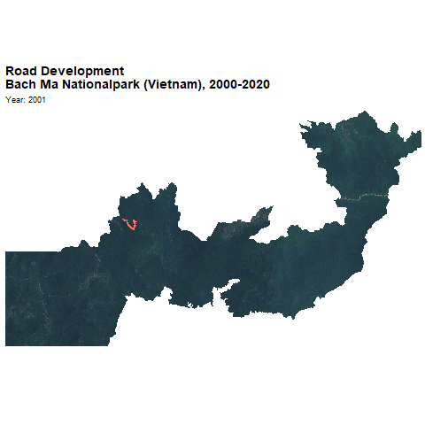

# RoadNetwork
# **Conservation Project on Road Development in Bach Ma Nationalpark (Vietnam)**

**Author:** Caroline Busse (July 2021)

## **Background**
The purpose of this script is to detect road development in Bach Ma Nationalpark (Vietnam) for the years 2000 untill 2020.

## **Analysis**
OSM Road data and Hansen Forest Loss data is intersected to detect the year in which the development of each road started.

Data sources: 
- Hansen Global Forest Change Data v1.8
- OSM Road Data, road data (courtesy of IZW)

